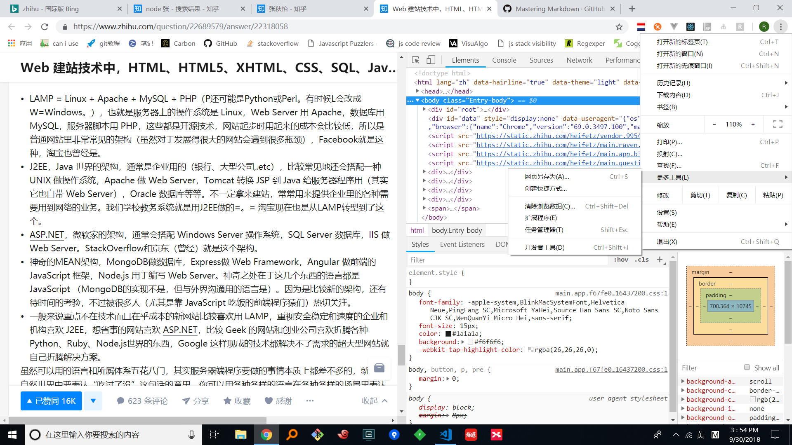

打开前端大门
======

### 最近有个朋友希望学习一些前端技术，但是没有任何编程的经验。因此写下这篇索引，希望可以对没有web开发经验的朋友有些帮助。

web开发技术栈介绍
-----
首推张秋怡的一篇好文[Web 建站技术中，HTML、HTML5、XHTML、CSS、SQL、JavaScript、PHP、ASP.NET、Web Services 是什么？](https://www.zhihu.com/question/22689579/answer/22318058)

读完之后，相信对web开发就会有一个直观的认识。同时，对于前端、后端的工作内容也会有一个最基础的了解。由于我是做前端的，接下来主要谈谈前端这一方面。

安装工具集
------
- 首先你需要一个chrome浏览器，由于国内限制无法直接访问谷歌，但是应该有其他镜像可以下载。开始前端训练的第一步就是找到足够方便、功能丰富、对开发者友好的试验场。抛弃360、QQ、sougou一众国内浏览器，使用chrome就是一个开始。
- 安装好之后按`ctrl+shift+i`，或者以点击浏览器的右上角,`更多工具 -> 开发者工具`，你会看到如下界面。文章里提到的`HTML CSS JavaScript`就在你面前展开了。你可以在这里完成所有训练。

- 你还需要一个文本编辑器，用于在本地更方便的编辑文本文件。推荐使用vscode，微软出品的编辑器，可以直接在官网下载安装。

起步的资源库
--------
- 国内的话可以使用 [w3school](http://www.w3school.com.cn/),任何有关HTML CSS JavaScript的基础知识都可以在这里找到。而且也配套了对应的练习。
- 在学习新事物的时候，先从整体了解它都是必要的。
- 在开始html训练前，要先了解dom。
- 开始css训练器前，要先了解盒子模型。
- 在开始javascript训练前，要先了解编程语言是如何工作的。
- 了解http与Ajax。
- 上面的内容我没有办法一一推荐特别突出的文章，但是相信各个社区里都有层出不穷的介绍，程序员本来的一项核心技能就是[搜索能力](https://www.zhihu.com/question/20163513/answer/15352380)。
- 在了解完背景知识之后，就可以开始训练了。编程本来就是一项工程实践，需要不断地联系。时间规划上来讲的话，建议HTML 3天， CSS 3天 JavaScript 1周。

开始初级的练手小项目
--------
- 完成上面的训练之后，就可以开始自己的第一个小项目了。我推荐的第一个小项目是自己仿造一个百度首页，如果发现无法独立完成，那确保你在做完页面之后可以理解你使用的所有HTML CSS JavaScript 知识。
- 上面的训练主要是针对HTML CSS的训练，完成之后就可以实现一个带增加、删除功能的Todo List(记事本)
- 在做这些练习的时候，可以使用[github](https://segmentfault.com/a/1190000005341489)来远程托管你的文件。

开始自己的前端工程
---------
- 完成了上面的小项目之后，你就走完了上个时代的前端开发之路了。但是距离可以找到一份工作还有一些距离。接下来你要做的事情就是选择一个前端库开始体验现代化的前端开发方式了。从个人的体验上我想推荐React、但是可能新手从vue开始确实过度会平稳一些。关于这两个库是如何工作的，官方网站都有对应的指引和说明项目。需要说明的是，这两个任何一个都有广泛的使用基础。熟练使用一个切换到另外一个都不会有很高的代价。
- 走到了框架这里，可能会有非常多的新知识如潮水一般涌来，比如 **Node npm webpack babel es6**等等，但是相信你在完成上面的从无到一的入门之后，有足够的能力和信心面对这些挑战。在这个过程中还是聚焦于主要的知识，即如何利用这些库实现一个前端工程，其他工程化的东西有一些了解即可。
- 当你可以较为熟练的使用这些UI库开发项目时我认为就可以试试找工作了。当然你要在整个训练的过程中尽可能要求自己理解看到的一切，试图保持好奇心，多问自己问题，然后需要的就是投简历、积累面试经验、然后一点好运气。

一些额外的建议
-------
- 使用google搜索，使用英文关键词搜索，碰到技术问题的话，可以使用stackoverflow 和 github issue解决。大多数情况下，中文搜索得到的信息都是杂音。
- 如果实在不行，使用必应搜索，碰到问题可上segmentfault关键字搜索。
- 也可以在知乎、掘金等网站里搜索一些技术文章，关注一些自己认可的程序员。他们会拓宽你的视角和知识边界。
- 克服畏难情绪和技术焦虑，保持思考。
- 享受编程，享受逻辑变成现实，技术为他人服务。

最后，祝玩的开心！

